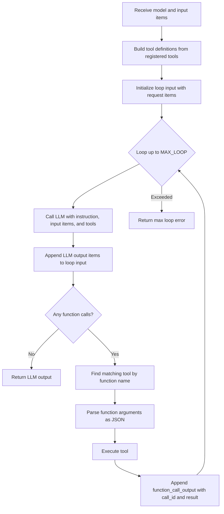

# Agent

Agent is a simple HTTP server built around an LLM-driven agent loop and pluggable tools.

## Process Flow

```mermaid
flowchart TD
    A[Receive model and input items] --> B[Build tool definitions from registered tools]
    B --> C[Initialize loop input with request items]
    C --> D{Loop up to MAX_LOOP}
    D --> E[Call LLM with instruction, input items, and tools]
    E --> F[Append LLM output items to loop input]
    F --> G{Any function calls?}
    G -- No --> H[Return LLM output]
    G -- Yes --> I[Find matching tool by function name]
    I --> J[Parse function arguments as JSON]
    J --> K[Execute tool]
    K --> L[Append function_call_output with call_id and result]
    L --> D
    D -- Exceeded --> M[Return max loop error]
```
